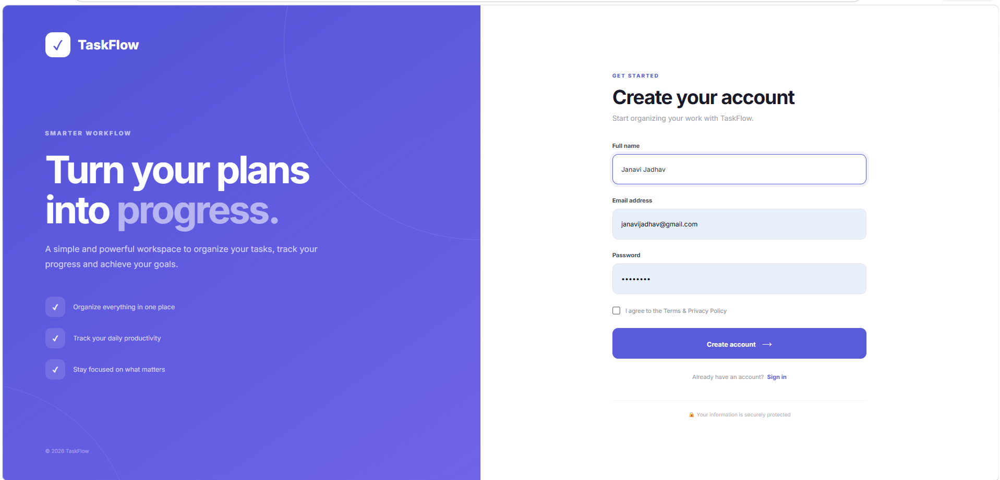
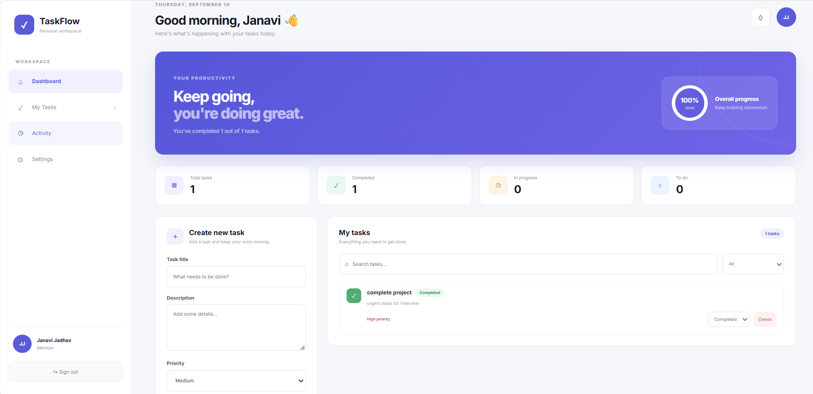

# TaskFlow — Task Management System

A full-stack task management web application built with **React**, **Node.js**, **Express**, and **MongoDB**.

---

## Screenshots

### Register Page


### Dashboard


---

## Features

- ✅ User Registration & Login with JWT Authentication
- ✅ Create, Read, Update, Delete Tasks
- ✅ Task Status — To Do / In Progress / Completed
- ✅ Task Priority — Low / Medium / High
- ✅ Search and Filter Tasks
- ✅ Live Progress Ring (completion percentage)
- ✅ Stats Overview — Total, Completed, In Progress, To Do
- ✅ Responsive Design (mobile + desktop)
- ✅ Data persists in MongoDB

---

## Tech Stack

| Layer     | Technology              |
|-----------|------------------------|
| Frontend  | React 19, Vite, CSS    |
| Backend   | Node.js, Express 5     |
| Database  | MongoDB, Mongoose      |
| Auth      | JWT, bcryptjs          |

---

## Project Structure

```
task-management-system/
├── backend/                      # Node.js + Express API
│   ├── config/db.js              # MongoDB connection
│   ├── controllers/
│   │   ├── authController.js     # Register & Login
│   │   └── taskController.js     # Task CRUD
│   ├── middleware/
│   │   └── authMiddleware.js     # JWT protect
│   ├── models/
│   │   ├── User.js               # User schema
│   │   └── Task.js               # Task schema
│   ├── routes/
│   │   ├── authRoutes.js         # /api/auth
│   │   └── taskRoutes.js         # /api/tasks
│   ├── .env
│   ├── package.json
│   └── server.js
│
├── src/                          # React frontend
│   ├── App.jsx                   # Auth + Dashboard
│   ├── App.css                   # Styles
│   ├── index.css                 # Base reset
│   └── main.jsx
│
├── screenshots/                  # App screenshots
├── index.html
├── vite.config.js
└── package.json
```

---

## Getting Started

### Prerequisites
- Node.js v18+
- MongoDB running locally

### Installation

```bash
# Clone the repo
git clone https://github.com/janavijadhav08/task-management-system.git
cd task-management-system

# Install backend dependencies
cd backend
npm install

# Install frontend dependencies
cd ..
npm install
```

### Run the App

**Terminal 1 — Backend**
```bash
cd backend
npm run dev
```

**Terminal 2 — Frontend**
```bash
npm run dev
```

Open **http://localhost:5173** in your browser.

---

## API Endpoints

### Auth
| Method | Endpoint            | Description       |
|--------|---------------------|-------------------|
| POST   | /api/auth/register  | Register new user |
| POST   | /api/auth/login     | Login user        |

### Tasks (Protected — JWT required)
| Method | Endpoint        | Description    |
|--------|-----------------|----------------|
| GET    | /api/tasks      | Get all tasks  |
| POST   | /api/tasks      | Create task    |
| PUT    | /api/tasks/:id  | Update task    |
| DELETE | /api/tasks/:id  | Delete task    |

---

## Author

**Janavi Jadhav** — [GitHub](https://github.com/janavijadhav08)

---

## License

MIT
